## 📦 Data Processing & Summarization Pipeline

A full-stack, multi-service project that takes a website URL, scrapes relevant content, summarizes it using a Gemini-powered LLM, and stores everything in a Postgres database via a centralized Spring Boot service.

---

## 🧱 Architecture Overview

```mermaid
graph TD;
    UI[🔵 UI: React + TypeScript]
    DS["🟢 DataService: Spring Boot - JPA & Postgres"]
    FS["🟣 FastAPI Scraper Service"]
    FL["🔴 Flask Summarizer Service (Gemini LLM)"]
    DB[(🗄️ PostgreSQL DB)]

    UI --> DS
    DS --> DB
    DS --> FS
    FS --> DS
    DS --> FL
    FL --> DS
    DS --> DB
```




---

## ⚙️ Components

### 1. 🔵 UI (React with TypeScript)
- Accepts user input (website URL)
- Sends request to DataService
- Displays status and summary

### 2. 🟢 DataService (Spring Boot)
- Uses JPA with Postgres
- Tables: `user_table`, `web_scrape_table`
- Workflow:
  1. Stores incoming URL
  2. Calls FastAPI Scraper
  3. Updates DB with scraped content
  4. Sends scraped data to Flask Summarizer
  5. Updates DB with summarized text

### 3. 🟣 FastAPI Scraper
- Uses `requests` + `BeautifulSoup`
- Extracts relevant content from URLs
- Returns structured data

### 4. 🔴 Flask Summarizer
- Calls Gemini API (LLM)
- Uses custom prompt with scraped data
- Returns summarized output

### 5. 🗄️ PostgreSQL + pgAdmin
- Hosted via Docker
- Accessible via pgAdmin for inspection & admin tasks

---

## 🛠️ Development Tools

| Tool       | Purpose                            |
|------------|------------------------------------|
| Docker     | Containerize and run Postgres      |
| pgAdmin    | Visual DB management               |
| IntelliJ   | Spring Boot backend development    |
| PyCharm    | Python microservices (FastAPI/Flask) |
| venv       | Python virtual environments        |
| Gradle     | Spring Boot project build          |
| TypeScript | Typed development in React         |

---

## 🚀 Setup & Usage

### 🐳 Start Postgres in Docker
```bash
docker-compose up -d
```
> Make sure `docker-compose.yml` sets up Postgres and optionally pgAdmin.

### ⚙️ Backend Setup (Spring Boot)
1. Import project in IntelliJ
2. Run using Gradle
3. Configure `application.properties` with Postgres credentials

### 🧪 FastAPI Setup
```bash
cd fastapi-scraper
python3 -m venv venv
source venv/bin/activate
pip install -r requirements.txt
uvicorn main:app --reload
```

### 🧠 Flask Summarizer Setup
```bash
cd flask-summarizer-service
python3 -m venv venv
source venv/bin/activate
pip install -r requirements.txt
python app.py
```

### 🖼️ Frontend Setup
```bash
cd react-app
npm install
npm start
```

---

## 📄 API Flow Summary

| Step | Service         | Description                            |
|------|------------------|----------------------------------------|
| 1    | UI               | User submits website URL               |
| 2    | DataService      | Saves URL to DB                        |
| 3    | FastAPI Scraper  | Scrapes and returns page content       |
| 4    | DataService      | Updates DB with scraped content        |
| 5    | Flask Summarizer | Summarizes scraped content via Gemini |
| 6    | DataService      | Updates DB with summarized text        |

---

Great! Let’s update the **README.md** file to clearly document how the **Groq API key** is used and where it should be placed. This improves setup clarity and helps developers avoid exposing sensitive keys during pushes.

Here’s the updated section to add to the README under **Setup & Usage** and **Environment Configuration**:

---

## 🔐 Environment Configuration

To enable summarization using the **Groq Gemini API**, you must insert your API key into a `.env` file used by the **Flask Summarizer Service**.

### 📁 `.env` setup for Flask Summarizer
Create the file at the root of the `flask-summarizer-service` folder:

```bash
touch flask-summarizer-service/.env
```

Add the following line (replace with your actual key):

```env
GROQ_API_KEY=your-groq-api-key-here
```

> 🛑 **Important:** Make sure `.env` is listed in `.gitignore` so that your secrets don’t get pushed to GitHub.

### 🧪 Load `.env` in Flask App
Inside your Flask app code, use `python-dotenv` to load the key:

```python
from dotenv import load_dotenv
import os

load_dotenv()
api_key = os.getenv("GROQ_API_KEY")
```

---

Want me to generate the full README file for copy-pasting, or help you define `.gitignore` rules for all services to keep secrets safe? Just say the word.
